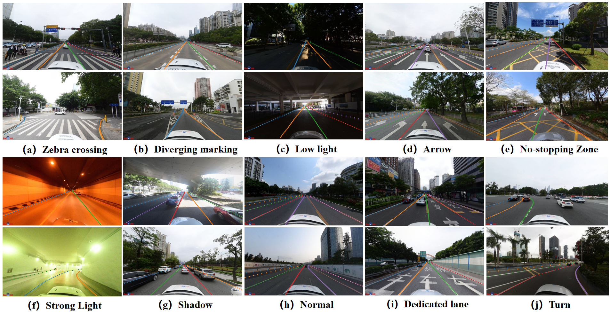
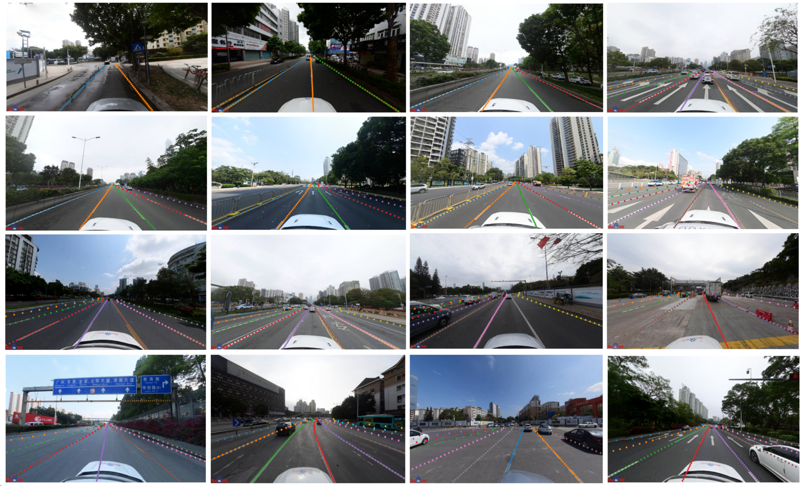
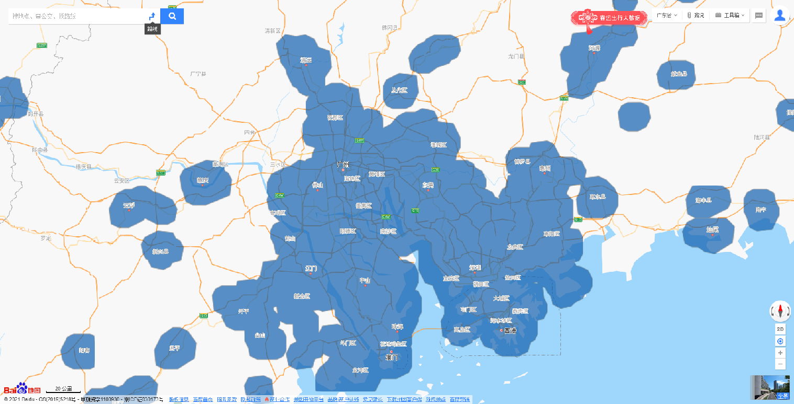
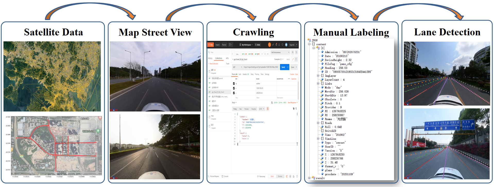
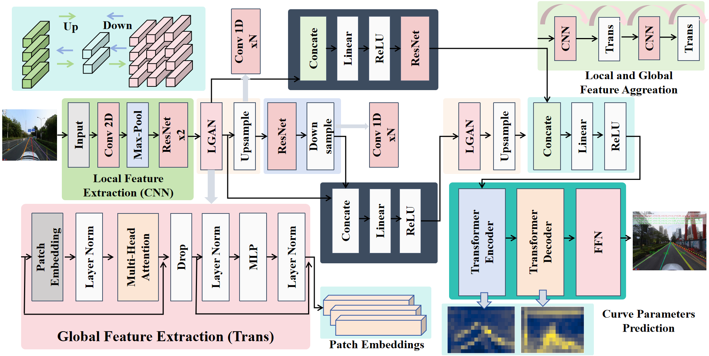
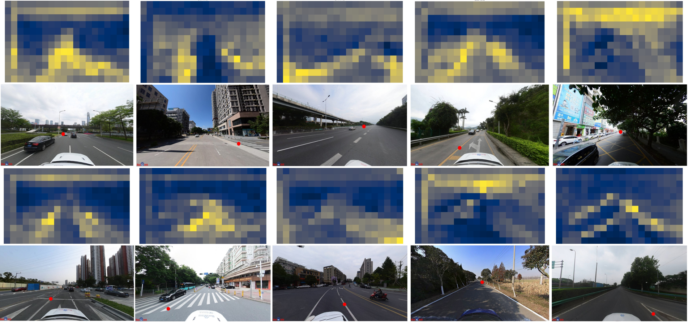
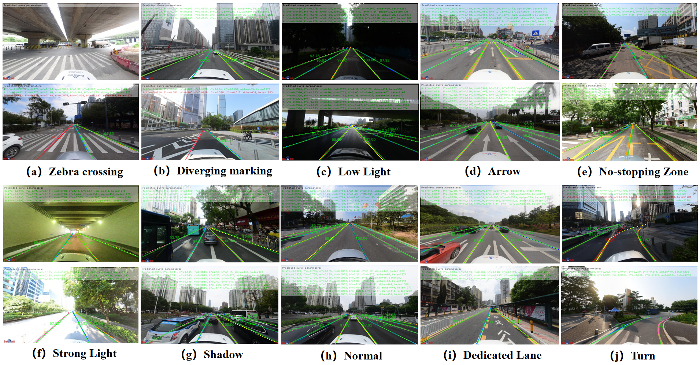

# MLD-Bench: A Multi-Lane Detection Benchmark and A Baseline for Autonomous Driving

# Annotation of different types of lane markings
 

# Annotation of Multi-lane Road Markings

 

#### We appreciate any useful suggestions for improvement of this paper from peers. Please raise issues or send an email to **liangxie@stu.pku.edu.cn**. Thanks for your cooperation!

**MLD-Bench: A Multi-Lane Detection Benchmark and A Baseline for Autonomous Driving**

# 数据集位置（Dataset directory）
链接: https://pan.baidu.com/s/1ilBTdm7dRSGxLuB-RkdjfQ?pwd=75vt 提取码: 75vt 
数据包括：原始图片，标注的车道线，以及车道线标签，目前已经按照训练集、测试集、验证集处理好

The dataset comprises: original images, annotated lane markings, and corresponding lane labels, which have been systematically organized into training, test, and validation sets.

# Dataset Collection location 

 

# Motivation

Lane detection is a critical component of autonomous driving systems. However, existing methods rely on overly simple benchmarks with fewer than four lanes and degrade in complex, high-density scenarios involving occlusions, intersections, and varying lighting. To address these limitations, we introduce MLD-Bench, a comprehensive dataset comprising 16,437 real-world road images. Most image contains up to 7 or more lanes, captured across a wide range of urban and highway scenarios, under varying weather conditions, and including complex road geometries such as curves, merges, and intersections. Collected across multiple cities in China and annotated with expert-verified instance-level labels over five months. The dataset provides a more faithful representation of real-world road complexity. Building upon this foundation, we develop a novel hybrid feature learning model that effectively combines local feature extraction with global context modeling through adaptive feature aggregation. Extensive experiments demonstrate our approach achieves state-of-the-art performance, particularly excelling in complex driving scenarios where existing methods typically struggle.

# Data Collect and Label

 

The MLD-Bench dataset is constructed through a systematic methodology to ensure comprehensive coverage of diverse driving scenarios. We collected street view imagery from major Chinese metropolitan areas over two months, including Beijing, Shenzhen, Guangzhou and Shanghai, using Baidu Maps' open platform, with an automated crawling system gathering images along with geographic coordinates and timestamps. The dataset incorporates multiple dimensions of variation: multi-lane highways and urban roads, diverse environmental conditions, complex road geometries, and challenging cases with occlusions or special markings. Following stringent quality control at a resolution of 1024$\times$576, the final curated dataset consists of 16,488 images across 11 progressively challenging scenario categories - from standard lane markings to unmarked roads, including shadow-occluded areas, curved segments, zebra crossings, low-light conditions, and strong-light conditions. 

For experimental validation, we implemented an 8:1:1 data split (13,873 training, 1,107 validation, 1,508 test images) using stratified sampling to maintain balanced representation of all scenario categories while preserving real-world distribution. This partitioning strategy enables fair algorithm comparison and ensures performance metrics reflect true capabilities rather than dataset biases, with challenging edge cases included across all subsets.

# MSTR Framework

 

To bridge above critical gaps, we introduce MLD-Bench, a groundbreaking benchmark dataset specifically designed for high-density and complex lane detection tasks. This meticulously curated dataset introduces several key advancements over existing resources. It achieves a large scale, comprising 16,488 high-resolution road images with an average of seven detectable lanes per frame. It captures diverse scenarios ranging from urban streets to high-speed highways. In addition, the data collection spans four major metropolitan areas in China, ensuring geographical diversity and real-world applicability. Moreover, a scientifically rigorous data partitioning scheme with 13,873 training images, 1,107 validation images, and 1,508 test images, facilitating robust model development and evaluation. All images were captured under varying weather and lighting conditions, with each frame undergoing professional instance-level annotation over five months. 

In parallel with the dataset contribution, we present a novel hybrid feature learning architecture that enhances feature extraction through the intelligent fusion of local and global visual information (MSTR). The proposed dual-branch architecture synergistically integrates the complementary strengths of convolutional and Transformer-based networks. One branch captures fine-grained local lane textures through its hierarchical convolutional operations, whereas the other branch effectively models long-range spatial relationships via self-attention mechanisms. By preserving local details and integrating global context, this module yields a more comprehensive and discriminative feature representation.
To sum up, the main contributions of this paper can be summarized as following three aspects:
(1) We introduce dense lane detection as a novel and practical task, expanding the scope of lane detection to capture fine-grained and comprehensive lane information.
(2) We construct a large-scale benchmark dataset, MLD-Bench, specifically designed for dense lane detection. It contains 16488 images recorded under various weather and complex conditions, each image have an averaged 7 lanes.
(3) We propose a novel hybrid feature learning framework that effectively integrates local and global features, leading to robust and accurate lane representation for dense lane detection.

# Feature Map

 

# MSTR Prediction Results

 